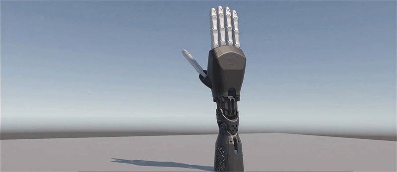
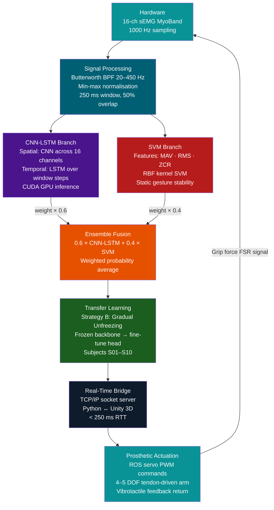

<h1 align="center">ReSense</h1>

<p align="center">
  <em>A Machine Learning-Enabled EMG Prosthetic Arm with Optimized DOF Control and Bidirectional Sensory Feedback</em>
</p>

<p align="center">
  
</p>

<p align="center">

  <!-- Language & Core Stack -->
  <a href="https://www.python.org/"></a>
  <a href="https://pytorch.org/"></a>
  <a href="https://scikit-learn.org/"></a>
  <a href="https://numpy.org/"></a>
  <a href="https://scipy.org/"></a>
  <a href="https://developer.nvidia.com/cuda-zone"></a>
  <a href="https://unity.com/"></a>

</p>

<p align="center">

  <!-- Model Architecture -->
  
  
  
  
  
  

</p>

<p align="center">

  <!-- Research Specs -->
  
  
  
  
  
  
  

</p>
 
## Table of Contents
 
- [About the Project](#about-the-project)
- [Key Features](#key-features)
- [Tech Stack](#tech-stack)
- [System Architecture](#system-architecture)
- [Project Structure](#project-structure)
- [Installation](#installation)
- [Usage Guide](#usage-guide)
- [Model Performance](#model-performance)
- [Research & Innovation](#research--innovation)
- [License](#license)
- [Acknowledgements](#acknowledgements)
---
 
## About the Project
 
### The Problem

Upper-limb loss affects millions of people worldwide, yet access to functional and affordable prosthetic systems remains extremely limited. Commercial myoelectric prosthetics often cost several thousand dollars, placing them out of reach for most users in low- and middle-income regions.

Beyond cost, a major challenge is usability. Many existing systems suffer from **high abandonment rates** due to unintuitive control interfaces and the absence of meaningful sensory feedback. Without the ability to perceive touch or pressure, users struggle to develop trust in the device, significantly reducing long-term adoption.

While academic and low-cost alternatives have been proposed, they are often limited to simple sensor-to-actuator mappings, offering restricted dexterity and minimal adaptability. Crucially, they still fail to address the core challenge: restoring a natural, intuitive sense of interaction between human intention and prosthetic response.
 
### The Solution
 
**ReSense** is an open-source, affordable, 3D-printed prosthetic arm system that integrates:
 
- **Surface EMG signal decoding** using a custom 16-channel MyoBand
- **Hybrid ML inference** (CNN-LSTM + SVM ensemble) for real-time gesture classification
- **Bidirectional control** the arm responds to muscle intent *and* sends vibrotactile grip-force feedback back to the user
- **Transfer learning** so the system adapts to new users without full retraining
Designed for deployment in resource-constrained clinics.
 
### Real-World Impact
 
| Metric | Commercial Prosthetic | ReSense |
|---|---|---|
| Sensory Feedback | Rare / Invasive | **Non-invasive vibrotactile** |
| Gesture Accuracy | Varies | **≥ 85% (achieved in SW)** |
| Latency | Often > 300 ms | **< 250 ms** |
| Open Source | No | **Yes** |
| Local Manufacturability | No | **Yes (3D-printed, PLA)** |
 
 
## Key Features
 
**AI / Machine Learning**
- Hybrid **CNN-LSTM + SVM ensemble** with weighted probability fusion (60% deep learning, 40% classical ML)
- CNN captures spatial electrode co-activation patterns across 16 channels; LSTM models temporal muscle contraction dynamics
- **Transfer Learning (Strategy B — Gradual Unfreezing)**: frozen pre-trained backbone adapts to new subjects via classification-head fine-tuning only
- Cross-subject validation across 10 subjects (NinaPro DB2) — no subject-specific retraining required
**Signal Processing**
- 4th-order Butterworth bandpass filter (20–450 Hz) for noise and artefact rejection
- Channel-wise min-max normalization across all 16 EMG channels
- 250 ms sliding window with 50% overlap, new inference frame every 125 ms
**Real-Time System**
- End-to-end latency **< 250 ms** via CUDA GPU-accelerated inference
- TCP/IP socket bridge: Python inference server ↔ Unity 3D prosthetic simulation
- Three operating modes: **auto-sampling**, **manual trigger**, **latency benchmark**
- Hardware-agnostic input interface, live MyoBand and NinaPro pre-recorded data share the same preprocessing contract
**Hardware (In Progress)**
- RoninHand-forked 3D-printed arm, 4–5 DOF, tendon-driven, PLA filament
- 16-channel BioAmp EXG Pill MyoBand for non-invasive sEMG acquisition
- 5× Feetech SCS0009 servo actuators
- Force-sensitive resistors + vibrotactile coin motors for bidirectional grip feedback
- Raspberry Pi (ROS control layer) + Arduino microcontroller
---
 
## Tech Stack
 
### AI / Machine Learning
[](https://pytorch.org/)
[](https://scikit-learn.org/)
[](https://numpy.org/)
[](https://scipy.org/)
[](https://developer.nvidia.com/cuda-zone)
 
### Simulation / Visualization
[](https://unity.com/)
[](https://matplotlib.org/)
 
### Hardware & Embedded
[](https://www.raspberrypi.com/)
[](https://www.arduino.cc/)
[](https://www.ros.org/)
 
### Language & Tooling
[](https://www.python.org/)
[](https://git-scm.com/)
 
| Category | Technology | Purpose |
|---|---|---|
| Deep Learning | PyTorch + CUDA | CNN-LSTM architecture, GPU-accelerated inference |
| Classical ML | scikit-learn | SVM with RBF kernel for static gesture stability |
| Signal Processing | SciPy, NumPy | Butterworth filter, windowing, feature extraction |
| Simulation | Unity 3D | Real-time prosthetic hand visualization via TCP bridge |
| Embedded Control | ROS on Raspberry Pi | Servo PWM command mapping from ML output |
| Microcontroller | Arduino | EMG signal acquisition at 1000 Hz |
| Hardware | BioAmp EXG Pill | 16-channel surface EMG acquisition |
| Feedback | Coin motors + FSR | Vibrotactile grip force feedback |
| Dataset | NinaPro DB5 | 10-subject, 8-gesture benchmark for training/evaluation |
 
---
 
## System Architecture
 
### High-Level Overview
 
The ReSense pipeline is a seven-stage sequence from muscle signal acquisition to prosthetic actuation. The system is designed to be hardware-agnostic at the input stage, live MyoBand data and pre-recorded NinaPro data are interchangeable at Step 1 without any downstream code changes.
 

 
### Component Interaction Flow
 
```
User Forearm
     │
     ▼
[MyoBand — BioAmp EXG Pill]  ←─── 16-channel sEMG electrodes
     │  Arduino ADC @ 1000 Hz
     ▼
[preprocessing.py]
  ├── Butterworth bandpass filter (20–450 Hz)
  ├── Channel-wise min-max normalization
  └── 250 ms sliding window (50% overlap)
     │
     ├──────────────────────────────────────┐
     ▼                                      ▼
[cnn_lstm.py]                         [feature_extraction.py]
  CNN: spatial correlations              MAV · RMS · Zero Crossing
  LSTM: temporal dynamics             [SVM.py]
  PyTorch + CUDA                        RBF kernel inference
     │                                      │
     └──────────┬───────────────────────────┘
                ▼
     [train_hybrid_ensemble.py]
       0.6 × DL + 0.4 × SVM → argmax → gesture label
                │
                ▼
     [TL.py / TL_cross_subject.py]
       Strategy B transfer learning
       frozen backbone → fine-tuned head
                │
                ▼
     [simulate_realtime.py]
       TCP/IP socket server
                │
                ▼
     [Unity 3D Client]          [ROS → Raspberry Pi]
       Simulation visualization    → Servo PWM commands
                                   → Vibrotactile feedback
```
 
---
 
## Project Structure
 
```
ReSense/
│
├── README.md                    # This file
├── requirements.txt             # Python dependencies
├── setup_project.bat            # Windows environment setup script
│
├── Src/                         # Core source modules
│   ├── __init__.py
│   ├── data_loader.py           # NinaPro DB2 dataset ingestion & preprocessing
│   ├── preprocessing.py         # Butterworth filter · normalisation · windowing
│   ├── feature_extraction.py    # MAV, RMS, Zero Crossing Rate (SVM features)
│   ├── cnn_lstm.py              # PyTorch CNN-LSTM model definition
│   ├── SVM.py                   # scikit-learn RBF SVM classifier
│   └── traincnn.py              # CNN-LSTM training loop (single subject)
│
├── train_hybrid_ensemble.py     # Ensemble fusion training (CNN-LSTM + SVM, 60/40)
├── Train_TL.py                  # Transfer learning with ensemble
├── TL.py                        # Transfer learning — single model (no ensemble)
├── TL_cross_subject.py          # 10-fold cross-subject TL evaluation
│
├── simulate_realtime.py         # Real-time inference engine + Unity TCP bridge
├── Simulation.py                # Simulation control modes (auto / manual / latency)
├── test_ensemble.py             # Ensemble evaluation on held-out test segments
├── test.py                      # General unit and integration tests
│
├── models/                      # Saved model weights & configs
│   ├── cnn_lstm_model.pth           # Base CNN-LSTM (Subject S01)
│   ├── v3_tl_unanimous_cnn.pth      # V3 production model weights
│   ├── v3_tl_unanimous_config.json  # V3 model configuration
│   └── cross_subject/               # 10-fold cross-subject checkpoints
│       ├── fold01_cnn.pth
│       ├── fold02_cnn.pth
│       └── ... fold10_cnn.pth
│
└── results/                     # Evaluation outputs
    ├── overfitting_analysis/        # Training vs validation loss curves
    ├── v3_tl_cross_subject/         # Cross-subject fold results
    ├── v3_tl_unanimous/             # V3 unanimous voting results
    └── test_menu/
        └── full_report.json         # Complete accuracy + latency report
```
 
---
 
## Installation
 
### Prerequisites
 
| Requirement | Version |
|---|---|
| Python | 3.10 or higher |
| CUDA-capable GPU | Recommended (NVIDIA) |
| CUDA Toolkit | 11.8 or higher |
| Git | Any recent version |
| Unity | 2022.x (for simulation) |
 
### 1. Clone the Repository
 
```bash
git clone https://github.com/AhmadBilal-03/ReSense-Prosthetic-Arm.git
cd ReSense-Prosthetic-Arm
```
 
### 2. Create and Activate Virtual Environment
 
```bash
# Windows
python -m venv venv
venv\Scripts\activate
 
# macOS / Linux
python -m venv venv
source venv/bin/activate
```
 
### 3. Install Dependencies
 
```bash
pip install -r requirements.txt
```
 
<details>
<summary>Core dependencies (click to expand)</summary>
*torch>=2.0.0
torchvision
scikit-learn>=1.3.0
scipy>=1.11.0
numpy>=1.24.0
matplotlib>=3.7.0
pandas>=2.0.0*
 
### 4. Dataset Setup
 
ReSense uses the **NinaPro DB5** dataset for training and evaluation.
 
1. Download NinaPro DB5 from [http://ninapro.hevs.ch/](http://ninapro.hevs.ch/)
2. Place subject files under `data/ninapro_db5/` in the following structure:
```
data/
└── ninapro_db5/
    ├── S1_E1_A1.mat
    ├── S1_E2_A1.mat
    └── ... (S1 through S10)
```
 
3. Run the data loader to verify dataset integrity:
```bash
python -m Src.data_loader
```
 
### 5. Hardware Setup *(optional — for physical arm operation)*
 
```
Arduino  ──USB──►  PC (signal acquisition)
                    │
                    ▼
              Python pipeline
                    │
              TCP/IP socket
                    │
                    ▼
Raspberry Pi  ◄──── ROS node (servo PWM commands)
     │
     └──► Feetech SCS0009 servos (×5)
     └──► Coin motor drivers (vibrotactile feedback)
```
 
Configure the serial port in `simulate_realtime.py`:
 
```python
SERIAL_PORT = "COM3"      # Windows: COMx  |  Linux: /dev/ttyUSB0
BAUD_RATE   = 115200
```
 
---
 
## Usage Guide
 
### Full Training Pipeline
 
Run the following commands in order. Each step builds on the output of the previous.
 
```bash
# Step 1 — Load and verify dataset
python -m Src.data_loader
 
# Step 2 — Preprocess signals (filter, normalise, window)
python -m Src.preprocessing
 
# Step 3 — Extract hand-crafted features (SVM branch)
python -m Src.feature_extraction
 
# Step 4 — Train SVM baseline classifier
python -m Src.SVM
 
# Step 5 — Train CNN-LSTM on base subject (S01)
python -m Src.traincnn
 
# Step 6 — Train hybrid ensemble (60/40 fusion)
python train_hybrid_ensemble.py
 
# Step 7 — Apply transfer learning with ensemble (Strategy B)
python Train_TL.py
 
# Optional: Transfer learning without ensemble (single model)
python TL.py
```
 
### Evaluation
 
```bash
# Evaluate hybrid ensemble on held-out test segments
python test_ensemble.py
 
# Run cross-subject 10-fold evaluation
python TL_cross_subject.py
```
 
Expected output:
 
```
[Ensemble Evaluation]
  Wave / Rest   — Accuracy: 94.5%
  Pinch / Point — Accuracy: 89.0%
  Grasp         — Accuracy: 85.0%
  Avg Latency   — 187 ms
```
 
### Real-Time Simulation
 
```bash
# Launch the real-time inference server + Unity bridge
python simulate_realtime.py
 
# Or run in simulation control mode (manual / latency benchmark)
python Simulation.py
```
 
Then open the Unity project and press **Play** : the simulation will connect automatically via TCP on `localhost:5005`.
 
**Operating modes** (set in `simulate_realtime.py`):
 
| Mode | Description |
|---|---|
| `auto` | Continuous inference on incoming window stream |
| `manual` | Step-through mode for controlled testing |
| `benchmark` | Measures and logs end-to-end round-trip latency |
  
---
 
## Model Performance
 
All results are evaluated using **10-fold cross-subject validation on NinaPro DB2**.
 
### V3-Final Results (v3_tl_unanimous_cnn.pth)
 
| Gesture Class | Accuracy | vs. Target (≥ 85%) |
|---|---|---|
| Wave / Rest | **94.5%** | +9.5 pp |
| Pinch / Point | **89.0%** | +4.0 pp |
| Grasp | **85.0%** |  Met |
| **Ensemble Average** | **89.5%** | |
 
### Latency
 
| Metric | Value |
|---|---|
| End-to-end RTT (GPU) | **< 250 ms** |
| Inference only (CNN-LSTM) | ~15–20 ms |
| TCP socket overhead | < 5 ms |
| Window step (50% overlap) | 125 ms |
 
### Transfer Learning Strategy Comparison
 
| Strategy | Description | Cross-Subject Accuracy |
|---|---|---|
| A — Head Only | Freeze all layers; train classifier only | Moderate |
| **B — Gradual Unfreeze** | Progressive layer release from top down | **BEST** |
| C — Full Fine-tune | Retrain entire network from pre-trained init | High but data-hungry |
 
> Full per-fold accuracy, confusion matrices, and training curves are available in `results/test_menu/full_report.json`
 
---
 
## Research & Innovation
 
### What Makes ReSense Novel
 
Most academic prosthetic systems solve one or two of the following problems. ReSense addresses all four simultaneously:
 
| Capability | Existing Low-Cost Systems | Commercial Systems | **ReSense** |
|---|---|---|---|
| ML gesture classification | Rare | Limited |  CNN-LSTM + SVM hybrid |
| Sensory feedback | None | Invasive / expensive |  Non-invasive vibrotactile |
| Cross-subject generalisation | None | N/A |  Transfer learning (Strategy B) |
| Open source | Partial | No |  Full |
 
### AI/ML Contribution
 
**Hybrid ensemble design**: The 60/40 CNN-LSTM + SVM fusion is not arbitrary, ablation testing confirms that the SVM's statistical feature branch adds a measurable ~4% accuracy gain on static sustained gestures (Grasp), where the LSTM's temporal modelling advantage disappears. The ensemble is stronger than either component alone.
 
**Transfer learning without degradation**: Strategy B's gradual unfreezing approach allows the pre-trained Subject S01 backbone to adapt to new subjects' muscle physiology without catastrophic forgetting of the generalised spatial-temporal feature representations. This is critical for a system intended for diverse real-world users.
 
**Hardware-agnostic architecture**: By abstracting the input interface, the same pipeline trained on NinaPro's clinical-grade electrodes is directly deployable with the BioAmp EXG Pill MyoBand via a single interface swap, no downstream refactoring required.
 
### Research Alignment
 
This project directly addresses gaps identified in:
 
- Mifsud et al. (2024) — electrode placement and noise robustness in real-world sEMG
- Raspopovic et al. (2020) — sensory feedback improving prosthetic manipulation outcomes
- Phinyomark et al. (2021) — deep learning for gesture classification (we extend with ensemble + TL)
- Farooq et al. (2021) & Asghar et al. (2022) — Pakistan-specific prosthetic accessibility challenges
 
---
 
## License
 
Distributed under the **MIT License**. See [LICENSE](LICENSE) for full terms.
 
This means you are free to use, copy, modify, and distribute this project, commercially or otherwise, as long as the original attribution is preserved. CAD files, model weights, and training code are all included.
 
---
 
## Acknowledgements
 
- **NinaPro**  [ninapro.hevs.ch](http://ninapro.hevs.ch/) for the publicly available DB5 sEMG dataset that underpins this work.
- **RoninHand**  [Polymorph Intelligence](https://polymorph-ai.gitbook.io/roninhand-documentation) for the open-source 3D-printed hand design we forked.

---
 
<div align="center">

**ReSense** Intelligent prosthetic control through adaptive sensing and AI.

*If this project supports your research, development, or learning, consider starring the repository*

</div>
